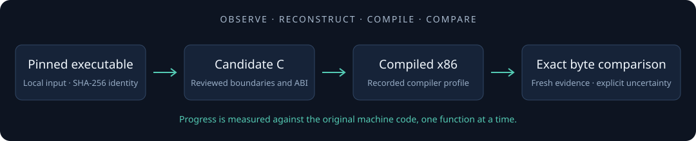

<div align="center">

# StarCraft Match

**A function-by-function matching decompilation of StarCraft: Brood War 1.16.1.**

[](https://github.com/nicodlz/starcraft-match/actions/workflows/portable.yml)


[](LICENSE)

[Getting started](#getting-started) · [Progress](#current-progress) · [Contributing](CONTRIBUTING.md) · [Contributing with AI](docs/contributing-with-ai.md) · [Evidence](docs/prior-art.md)

</div>



This project reconstructs independently written C/C++ and compares its compiled
machine code with a pinned original executable. Equivalent behavior is useful;
**identical machine code is the matching target**. Each claim has an address,
reviewed boundary, calling convention, compiler profile and reproducible comparison.

This is an early research repository, not a playable engine. It contains no Blizzard
executables or game assets, performs no original-process execution, and does not yet
link a complete program. Faithful 1.16.1 reconstruction comes before any modern port.

## Current progress

**134 whole functions match exactly, totaling 1,924 original bytes.** The independent
candidates are pure C; no original-byte arrays, copied assembly or post-build patches
are used to obtain these results. They include global accessors, trigger callbacks,
an indexed unit-property predicate, pointer-link insertion, conditional AI state updates
and image-state callbacks. The [100-function milestone batch](docs/hundred-functions-2026-10-02.md)
added 82 exact functions / 1,063 bytes: 76 static data initializers, four game
routines and two one-byte no-op callbacks. The 76 initializers account for 836 bytes;
their destination semantics remain unknown. The numeric milestone does not establish
100 representative gameplay routines or a representative whole-game match rate.
A subsequent [continuous research lot](docs/continuous-2026-10-02.md) promoted
one previously unmatched 20-byte game leaf without changing its C source.
The [first historical-compiler lot](docs/historical-2026-10-02.md) adds 24 game
functions / 480 bytes, including list traversals, counting loops and score calculations.

The table lists the 34 earlier non-initializer functions; the 24 historical-toolchain
additions are listed in the report linked above. The 76 initializer entries, their
destinations and startup slots are listed in the milestone report linked above.

| Address | Community annotation | Original / compiled | Result |
| --- | --- | ---: | --- |
| [0x00402C40](docs/functions/00402C40.md) | getHPGainForRepair | 20 / 20 | Exact |
| [0x004180C0](docs/functions/004180C0.md) | DLG_nextEntry | 13 / 13 | Exact |
| [0x00423180](docs/functions/00423180.md) | BTNSACT_DoNothing | 1 / 1 | Exact |
| [0x00427E40](docs/functions/00427E40.md) | BRFACT_NoAct_fn | 6 / 6 | Exact |
| [0x004282D0](docs/functions/004282D0.md) | BTNSCOND_Always | 8 / 8 | Exact |
| [0x0042C680](docs/functions/0042C680.md) | TRGCND_Always | 6 / 6 | Exact |
| [0x00446BA0](docs/functions/00446BA0.md) | AI_SetTargetExpansion_Off_SubAttacks | 32 / 32 | Exact |
| [0x00455650](docs/functions/00455650.md) | OrderAcquire_Nothing | 8 / 8 | Exact |
| [0x00473490](docs/functions/00473490.md) | unitIsResourceContainer | 18 / 18 | Exact |
| [0x0047A070](docs/functions/0047A070.md) | image_Insert | 25 / 25 | Exact |
| [0x0047CCB0](docs/functions/0047CCB0.md) | saveMinimapCounts | 23 / 23 | Exact |
| [0x0047D160](docs/functions/0047D160.md) | nullsub_gameloop | 1 / 1 | Exact |
| [0x00484350](docs/functions/00484350.md) | NullInput | 1 / 1 | Exact |
| [0x00488780](docs/functions/00488780.md) | isGamePaused | 6 / 6 | Exact |
| [0x00496FF0](docs/functions/00496FF0.md) | EnableVisibilityHashUpdate | 11 / 11 | Exact |
| [0x00498150](docs/functions/00498150.md) | Sprite_SetVerticalOffset | 22 / 22 | Exact |
| [0x0049DCE0](docs/functions/0049DCE0.md) | CListPushBackHiddenUnitEntry | 55 / 55 | Exact |
| [0x004B2AF0](docs/functions/004B2AF0.md) | structureScoreCalc | 60 / 60 | Exact |
| [0x004B2B30](docs/functions/004B2B30.md) | unitScoreCalc | 60 / 60 | Exact |
| [0x004C5000](docs/functions/004C5000.md) | Trigger: enable debug mode | 18 / 18 | Exact |
| [0x004C5020](docs/functions/004C5020.md) | Trigger: disable debug mode | 18 / 18 | Exact |
| [0x004C50C0](docs/functions/004C50C0.md) | Trigger: unpause timer | 16 / 16 | Exact |
| [0x004C51B0](docs/functions/004C51B0.md) | TRGACT_SetMissionObjectives_fn | 22 / 22 | Exact |
| [0x004C52A0](docs/functions/004C52A0.md) | TRGACT_PreserveTrigger_fn | 18 / 18 | Exact |
| [0x004C5350](docs/functions/004C5350.md) | TRGACT_NoAct_fn | 6 / 6 | Exact |
| [0x004CB550](docs/functions/004CB550.md) | CHK_TYPE | 8 / 8 | Exact |
| [0x004CE6B0](docs/functions/004CE6B0.md) | SetMapStartStatus | 8 / 8 | Exact |
| [0x004CE6C0](docs/functions/004CE6C0.md) | getMapStartStatus | 6 / 6 | Exact |
| [0x004D0910](docs/functions/004D0910.md) | Unnamed DWORD getter | 6 / 6 | Exact |
| [0x004D55F0](docs/functions/004D55F0.md) | ImageUpdate_Null | 1 / 1 | Exact |
| [0x004D5900](docs/functions/004D5900.md) | Unnamed conditional byte-state update | 21 / 21 | Exact |
| [0x004DBC00](docs/functions/004DBC00.md) | setSinglePlayerValue | 22 / 22 | Exact |
| [0x004DC540](docs/functions/004DC540.md) | SetInGameLoop | 12 / 12 | Exact |
| [0x004E1220](docs/functions/004E1220.md) | MenuGenericBtnInitChildren | 50 / 50 | Exact |

Names are community annotations, not authenticated original symbols. Exact means
literal equality across the entire reviewed function, excluding inspected padding,
with the observed ABI represented in the candidate.

Nineteen reviewed functions remain unmatched, including the initial unit-state predicate
[`0x004020B0`](docs/functions/004020B0.md) (50 / 48 bytes),
[`0x004C50D0`](docs/functions/004C50D0.md) (11 / 16 bytes), and seventeen candidates
from the [20-worker batch](docs/batch-2026-10-02.md). Their complete regions and
measured compiler/ABI differences are documented in the catalog and function notes.
Three further regions compile
but lack independent entry corroboration; they remain exploratory and are excluded
from the exact-function count. The total number of game functions is **not measured**.
The public BWAPI map lists **4,201 distinct function entries**; our 134 matches are
about **3.19% of that community list by function count**, not by code size or effort.
The map is not a verified exhaustive census. See [function counts](docs/function-census.md).
This small sample demonstrates the workflow, not large-scale reconstruction success.

## Getting started

On Linux, the portable workflow needs **Python 3.10+**, **Clang**, **GNU objdump** and
**Make**. GCC runs the native candidate truth-table test. There are no Python package
dependencies, and these isolated candidates require no Windows SDK or CRT.
The measured profiles use **Clang 18.1.3**, generating i686 Windows COFF with `-O2`
or `-Oz`; a separate narrow-register profile disables one LLVM widening pass.
Historical profiles additionally require locally supplied Microsoft C 13.10.3077
and wibo 1.2.0. Their binaries are not bundled. `make` can compile these sources
with an explicit Clang fallback when the default historical toolchain is absent;
exact matching and `make proof` require the recorded compiler.
See [environment](docs/environment.md) and [toolchain evidence](docs/toolchain.md).

```sh
git clone https://github.com/nicodlz/starcraft-match.git
cd starcraft-match
make                          # Build every candidate and run the test suite
./tools/decomp status
```

A clean clone builds without the original executable. The real-binary regression
test is skipped until the supported local input is supplied. Public CI checks
source compilation, portable tests and tracked-file policy; its green badge does
**not** assert that the original game was available in CI.

### Supply the immutable target locally

Place a legally obtained **StarCraft: Brood War 1.16.1 Windows executable** at:

```text
original/StarCraft.exe
```

The supported initial specimen is PE32 i386, 1,220,608 bytes, file version 1.16.1.1,
with SHA-256:

```text
ad6b58b27b8948845ccfa69bcfcc1b10d6aa7a27a371ee3e61453925288c6a46
```

The hash pins a reviewed specimen; it is not a publisher authenticity certificate
or a claim about every regional distribution. See [provenance](docs/binary-provenance.md)
and [`config/target.json`](config/target.json). A clone does not contain the executable.

```sh
./tools/decomp analyze
make proof                    # Recompile and require all 134 exact matches
./tools/decomp match 0x00498150 --require-exact
./tools/decomp task 0x00498150 --out analysis/tasks/00498150.json
```

`make proof` fails on a regression and writes a private aggregate report to
`analysis/proof-of-concept.json`. A real-binary test deliberately changes a candidate
in a private source-only checkout to confirm that the failure gate works.
Twenty tests pass with the executable and required local compiler profiles; a
source-only checkout passes nineteen and skips the real-binary test.

Install the local commit guard in a fresh clone:

```sh
printf '#!/bin/sh\nexec ./tools/check-publication --staged\n' > .git/hooks/pre-commit
chmod +x .git/hooks/pre-commit
```

## Analysis and matching tools

| Command | Purpose |
| --- | --- |
| `./tools/decomp analyze` | Export deterministic PE identity, imports, sections, strings, function seeds and symbols |
| `./tools/decomp build-all` | Compile every reviewed candidate without needing the game |
| `./tools/decomp match ADDRESS` | Rebuild one candidate and emit a literal byte/disassembly diff |
| `./tools/match function ADDRESS` | Short wrapper for the same comparison |
| `./tools/decomp verify-matches` | Require every reviewed exact-match expectation to pass |
| `./tools/decomp next` / `show ADDRESS` | Inspect the catalog and its exploratory work |
| `./tools/decomp task ADDRESS` | Export one local function task with fresh match evidence |
| `./tools/decomp status` | Count candidates and fresh local results |

Analysis writes `binary.json`, `imports.json`, `sections.json`, `strings.json`,
`functions.json` and `symbols.json` under ignored `analysis/`. The basic reader seeds
entry/export addresses and incorporates reviewed functions; it does not perform a
complete function census. Printable-string scanning can produce false positives.
Stripped names, undiscovered references and unknown boundaries stay unknown.

Unknown hashes are rejected for matching. Read-only exploration can explicitly use
`analyze --binary original/other.exe --allow-unverified --out analysis/other`; this
never changes the supported target or promotes guesses into reviewed functions.

Matching compares the pinned PE region with the isolated compiled COFF function.
Reports retain compiler/source/header/record hashes and literal differences.
Instruction similarity and CFG scores are **null**, because reliable scoring for
those metrics has not been implemented. Unresolved relocations are rejected.

Optional headless Ghidra integration is supplied for discovery, disassembly,
decompiler output, calls, references, strings and symbols:

```sh
GHIDRA_HOME=/path/to/ghidra ./tools/ghidra/run-headless
```

Ghidra/Java were absent on the initial host, so this integration remains unvalidated.
See [Ghidra instructions](tools/ghidra/README.md). The strongest original-compiler
hypothesis is **MSVC 7.1 / VS .NET 2003**; simple matches with modern Clang do not
establish broad compiler equivalence.

## Contributing

Start with [CONTRIBUTING.md](CONTRIBUTING.md). Reserve one function, inspect its
binary evidence, reconstruct a minimal candidate, compile it, compare it, and open
a small PR with the result and remaining uncertainty. Contributions to tooling,
boundary review, documentation and compiler experiments are also useful.

For agent-assisted work, read [Contributing with AI](docs/contributing-with-ai.md)
and [AGENTS.md](AGENTS.md). Parallel workers own distinct addresses and paths; a
coordinator independently rebuilds and verifies results before integration.
Automated success reports never replace original-byte evidence.

**Keep proprietary material local.** `original/`, `downloads/`, `analysis/`, `build/`
and `.local/` are ignored and are not release artifacts. Never force-add binaries,
assets, code extracts or complete decompiler/export dumps, attach them to public
issues, or upload them as CI artifacts. No third-party implementation is copied into
this tree. Source contributions use the [MIT license](LICENSE); it grants no rights
to Blizzard's binaries/assets or other third-party works. This project is independent
and is not affiliated with or endorsed by Blizzard Entertainment.

## Repository map

```text
config/               target identity, compiler profiles, function catalog/schema
include/reverse/      minimal observed layouts and fixed-address views
src/{game,map,units}/ independently compilable candidates
tools/analysis/      bounds-checked PE reader
tools/matching/      isolated COFF extraction and literal/disassembly comparison
tools/ghidra/        optional headless analysis/export
tests/               synthetic tests and optional local-binary regression
docs/functions/      per-address evidence, ABI, source reasoning and results
.github/             portable CI and contribution templates
```

Documentation: [Prior art](docs/prior-art.md) · [Toolchain](docs/toolchain.md) ·
[Agent pipeline](docs/agent-pipeline.md) · [Validation ladder](docs/validation.md).

## Next milestones

1. The **100 exact-function numeric milestone** is reached. Grow to **100
   representative functions** beyond repeated static initializers, measuring time,
   dependencies, exact-match rate and human review needed per function.
2. Extend the validated local historical compiler experiments to harder routines,
   linked placement and relocation-aware comparisons; validate headless Ghidra.
3. Evaluate larger-scale agent scheduling only after those measurements. Original
   differential execution, deterministic simulation and replay synchronization
   remain later validation levels; modernization remains out of scope.
